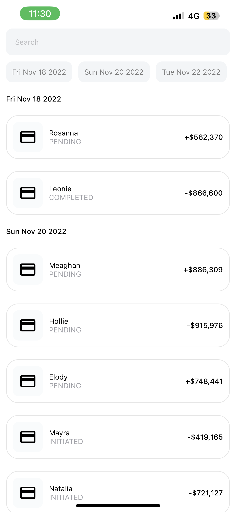
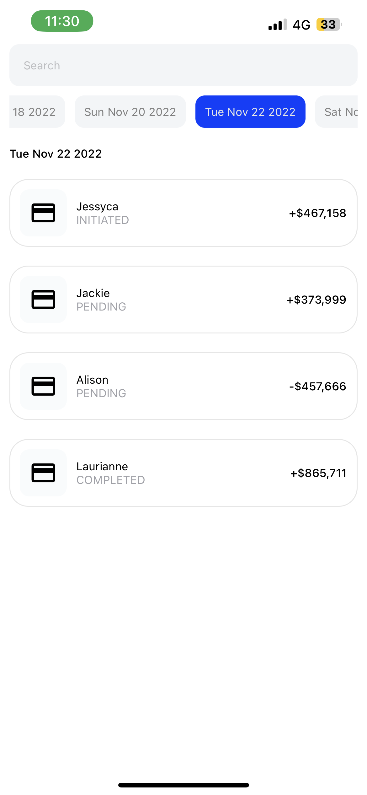
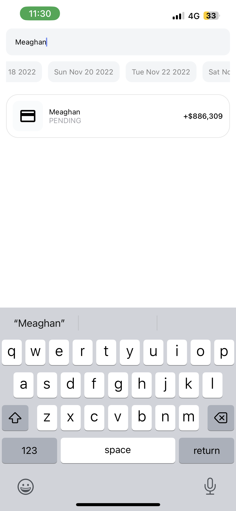

# Engineering Challenge

This react native app implements a simple list of transactions that can be filtered by date or a search term.

By using a basic graphql api created [here](https://github.com/Mike-M-87/probable-rotary-phone), I used the [graphql request](https://www.npmjs.com/package/graphql-request) package to fetch the data.

<div style="display:flex">
    
    
    
</div>


To run this app clone this repository then run
```
$ expo start
```

To run the app directly on your phone, install  [Expo Go](https://expo.dev/client) then scan this qr code from your phone


